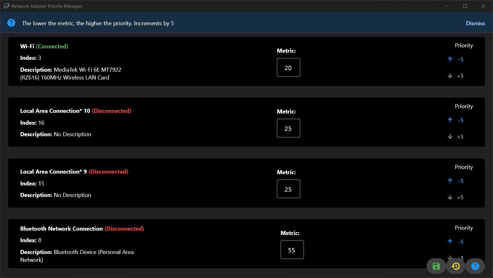

# Netadapterpriority app

<!-- Logo -->


This app is designed to make adjusting the priority of your network adapters much more accessible and without the need of typing in powershell commands.



## Download

The latest release can be found on the right in releases. Simply extract the root folder wherever you like and run the executable **AS ADMINISTRATOR**.

# Development

## Run the app

Requirements:

- Python 3.13
- flet 0.80
- uv (package manager for python)

### uv

Run as a desktop app:

```
uv run flet run
```

For more details on running the app, refer to the [Getting Started Guide](https://docs.flet.dev/).

## Build the app

### Windows

```
flet build windows -vv
```

For more details on building Windows package, refer to the [Windows Packaging Guide](https://docs.flet.dev/publish/windows/).
